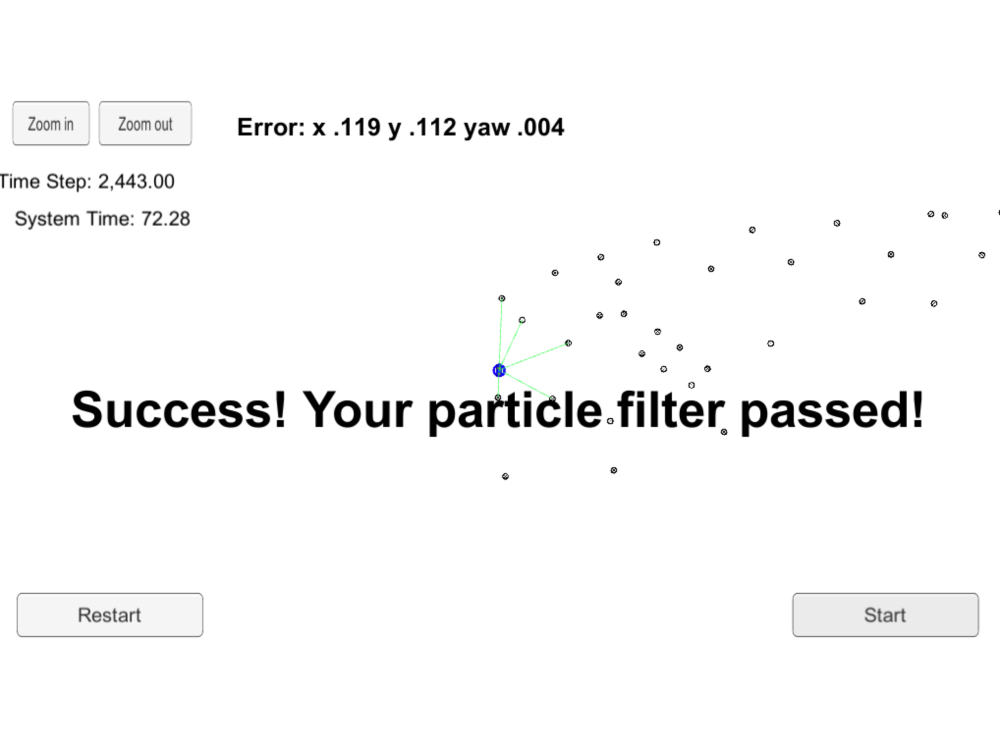

## Introduction
The robot has been kidnapped and transported to a new location! Luckily it has a map of this location, a (noisy) GPS estimate of its initial location, and lots of (noisy) sensor and control data.

In this project, I implemented a 2 dimensional particle filter in C++. The map and some initial localization information is given (analogous to what a GPS would provide). At each time step your filter will also get observation and control data.

## Building and Running the Code

* This project involves the Udacity Term2 Simulator which can be downloaded [here](https://github.com/udacity/self-driving-car-sim/releases)

* This repository includes two files that can be used to set up and install _uWebSocketIO_ for either _Linux_ or _Mac_ systems. For windows you can use either _Docker_, _VMware_, or even _Windows 10 Bash_ on _Ubuntu_ to install _uWebSocketIO_.

Once the install for uWebSocketIO is complete, the main program can be built and ran by doing the following from the project top directory.

* Build particle filter project:

```bash
$ ./build.sh
```

* Run particle filter

```bash
$ ./run.sh
```

## Application protocol

Here is the main protocol that _main.cpp_ uses for _uWebSocketIO_ in communicating with the simulator.

_**Input** values provided by the simulator to the c++ program:_

```
// sense noisy position data from the simulator

["sense_x"]

["sense_y"]

["sense_theta"]

// get the previous velocity and yaw rate to predict the particle's transitioned state

["previous_velocity"]

["previous_yawrate"]

// receive noisy observation data from the simulator, in a respective list of x/y values

["sense_observations_x"]

["sense_observations_y"]
```


_**Output** values provided by the c++ program to the simulator_

```
// best particle values used for calculating the error evaluation

["best_particle_x"]

["best_particle_y"]

["best_particle_theta"]

//Optional message data used for debugging particle's sensing and associations

// for respective (x,y) sensed positions ID label

["best_particle_associations"]

// for respective (x,y) sensed positions

["best_particle_sense_x"] <= list of sensed x positions

["best_particle_sense_y"] <= list of sensed y positions
```


## Inputs to the Particle Filter

You can find the inputs to the particle filter in the `data` directory.

`map_data.txt` includes the position of landmarks (in meters) on an arbitrary Cartesian coordinate system. Each row has three columns

* x position
* y position
* landmark id

## Implementation details

For fast searching nearest neighbor points I used `nanoflann` one header library. I wrote `Map` class to maintain heavy KNN requests to search nearest among all available landmarks on the 2D map  .

## Results

Minimal time which I have gotten at Udacity track is 50 seconds on 2015's macbook laptop. This is quite impressive as naive approach O(n^3) gives very poor results (> 200 sec).



> * Map data provided by 3D Mapping Solutions GmbH.
